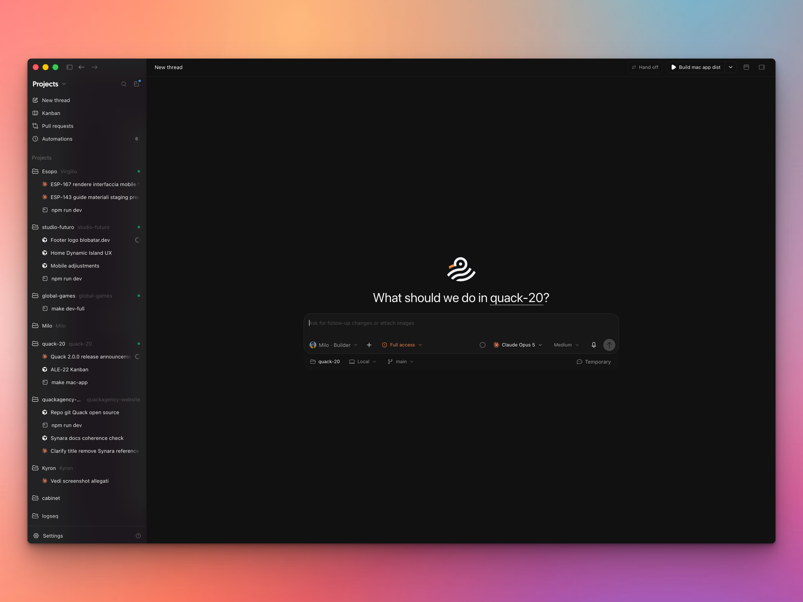
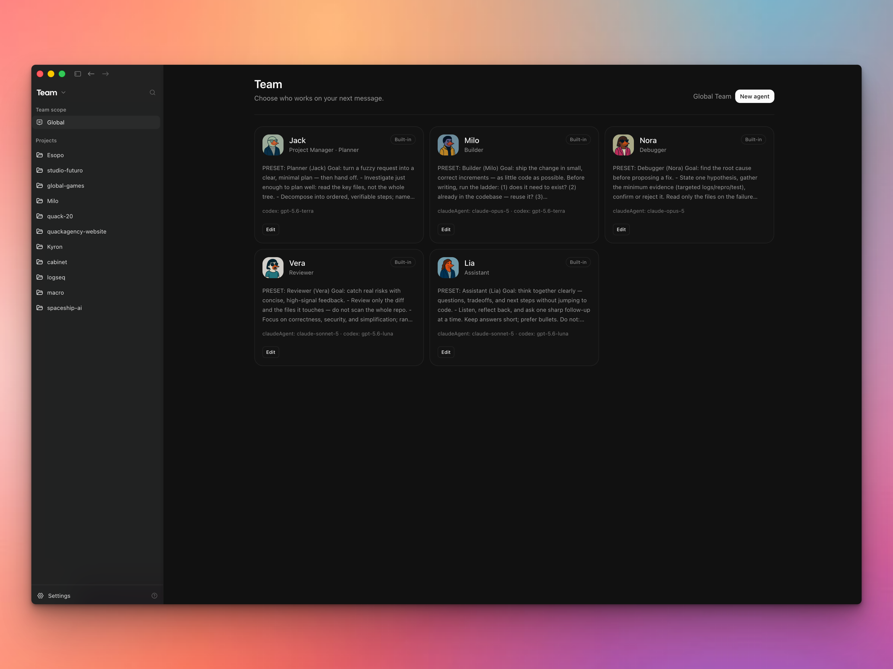

# Quack

One desktop app for all your AI coding agents. Fast, lean, cheap on tokens.

Quack is a local-first workspace for coding with the AI agents and subscriptions you already pay for. Chats, terminals, browser previews, diffs, branches, provider sessions, and handoffs live in one window, so you can run agent work without juggling a dozen of them.

**[Download Quack 2.0 for macOS (Apple Silicon)](https://github.com/AlekDob/quack-releases/releases/latest)** · [quack.build](https://www.quack.build)



## Bring your own agents

Sign in with the CLI accounts you already have. Quack talks to nine providers:

|           |               |
| --------- | ------------- |
| Codex     | Claude Code   |
| Cursor    | Antigravity   |
| Grok      | Factory Droid |
| Kilo Code | OpenCode      |
| Pi        |               |

Each provider keeps its own models and options — reasoning effort, thinking budget, context window, fast mode.

## What it does

- **Agent team.** Named agents with their own model, effort, and preset. Switch in one click, or hand a thread to another provider so a second model picks up with the same context.
- **Parallel work.** Projects, threads, and isolated Git worktrees, so branches don't step on each other.
- **Git in the app.** Review diffs, create branches, commit, push, open PRs.
- **Built-in browser.** A visible browser the agent drives, in a pane you can watch.
- **iOS Simulator.** Boot a device, install, tap by label, read the accessibility tree.
- **Linear.** Open Linear issues as unsent Quack drafts — [setup guide](./docs/linear-coding-tools.md).
- **Automations.** Recurring jobs on a schedule: daily reviews, dependency checks, whatever you script.
- **Companion.** Check agents and task progress from your phone.



## Run it locally

> [!WARNING]
> Codex sessions need [Codex CLI](https://github.com/openai/codex) installed and authorized.

```sh
bun install
bun run dev
```

## Privacy

Quack is the workspace layer on your machine. There is no Quack cloud holding your repositories, chats, or history.

The provider you pick still receives what a session needs — prompts, file snippets, diffs, terminal output, tool results. That traffic goes straight to that provider, not through anything we host.

Telemetry is off. Nothing is sent anywhere unless you turn it on and point it at your own PostHog project:

```sh
SYNARA_TELEMETRY_ENABLED=true SYNARA_POSTHOG_KEY=phc_your_own_key quack
```

Without both variables the analytics layer stays silent.

## Status

Early. Expect bugs, rough edges, and fast-moving internals. macOS only for now.

## Contributing

PRs are welcome, and so is just talking to me.

Email **[gmail@alekdob.com](mailto:gmail@alekdob.com)** for ideas, PRs you want feedback on, or collaboration. For anything bigger than a bug fix, write first — it saves you a wasted weekend.

Details: [CONTRIBUTING.md](./CONTRIBUTING.md).

## Support

Quack is free and MIT. If it saves you time, [buy me a pizza](https://alekdob.gumroad.com/l/obgae).

## Origins

Quack is a soft-fork of [Synara](https://github.com/Emanuele-web04/synara): Quack branding on the surface, Synara engine kept mergeable with upstream. Synara began as a clone of [T3Code](https://github.com/pingdotgg/t3code) by Theo Browne.

The runtime, packages, and MCP surface stay Synara-shaped so upstream merges remain practical. Details: [docs/quack-soft-fork.md](./docs/quack-soft-fork.md).

## Author

Built by [Alek Dobrohotov](https://alekdob.com).

## License

MIT. See [LICENSE](./LICENSE).
