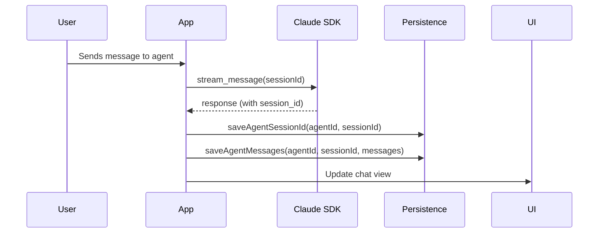
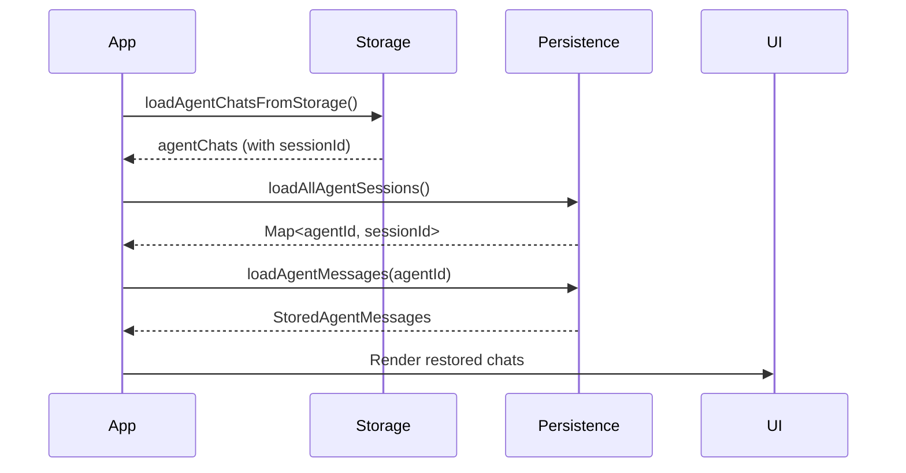

# Agent Chat Persistence

**Status**: Implemented
**Date**: 2026-01-08
**Version**: 0.3.0

## Overview

Agent chat persistence automatically saves and restores agent conversations across app restarts. When you close and reopen Quack, your agent chats will resume exactly where you left off, including:

- Chat history (messages)
- Claude SDK session ID (for context continuity)
- Stamina indicators (token usage)

## Problem

**Before this feature:**
- Agent chats disappeared on app restart
- Stamina indicator showed low values but no messages were visible
- Users had to start new conversations every time
- Session IDs were loaded but not used for resuming

**After this feature:**
- Agent chats automatically restore on app startup
- Full conversation history is preserved
- Session IDs are used to resume Claude SDK sessions
- Stamina indicators reflect actual usage

## Architecture

### Files

- **`src/services/agentChatPersistence.ts`** - Core persistence service
  - `saveAgentSessionId()` - Save Claude SDK session ID
  - `saveAgentMessages()` - Save chat messages
  - `loadAllAgentSessions()` - Load all session IDs on startup
  - `loadAgentMessages()` - Load messages for an agent
  - `deleteAgentData()` - Cleanup when agent is deleted

- **`src/App.tsx`** - Integration points
  - Line 2021: Pass saved `sessionId` to Claude SDK for resume
  - Line 2106-2118: Save sessionId and messages after each response
  - Line 5545-5578: Restore messages on app startup (first branch)
  - Line 5638-5671: Restore messages on app startup (second branch)
  - Line 9175-9180: Delete persisted data when agent is deleted

### Storage

Two separate stores for better organization:

1. **`quack-agent-sessions.json`** - Maps agentId to sessionId
   ```json
   {
     "agentSessionMap": {
       "agent-123": "claude-session-abc",
       "agent-456": "claude-session-def"
     }
   }
   ```

2. **`quack-agent-messages.json`** - Stores messages per agent
   ```json
   {
     "agentMessages_agent-123": {
       "agentId": "agent-123",
       "sessionId": "claude-session-abc",
       "messages": [
         {
           "role": "user",
           "content": "Hello",
           "timestamp": 1704700000000
         },
         {
           "role": "assistant",
           "content": "Hi there!",
           "timestamp": 1704700001000
         }
       ],
       "lastUpdated": 1704700001000
     }
   }
   ```

## Flow

### 1. Saving (During Chat)



**Code:**
```typescript
// After receiving response from Claude SDK
await saveAgentSessionId(activeId, response.session_id);
const currentMessages = chatSessions.get(activeId) || [];
await saveAgentMessages(activeId, response.session_id, currentMessages);
```

### 2. Restoring (On App Startup)



**Code:**
```typescript
// On app startup
const existingChats = await loadAgentChatsFromStorage();

// Restore session IDs
const initialSessionIds = new Map();
existingChats.forEach(agent => {
  if (agent.sessionId) {
    initialSessionIds.set(agent.id, agent.sessionId);
  }
});
setChatSessionIds(initialSessionIds);

// Restore messages
const initialChatSessions = new Map();
for (const agent of existingChats) {
  const storedMessages = await loadAgentMessages(agent.id);
  if (storedMessages) {
    const chatMessages = storedMessages.messages.map((msg, index) => ({
      id: `msg-restored-${agent.id}-${index}`,
      role: msg.role,
      content: msg.content,
      timestamp: msg.timestamp,
      status: 'complete',
    }));
    initialChatSessions.set(agent.id, chatMessages);
  }
}
setChatSessions(initialChatSessions);
```

### 3. Resuming Session

When sending a new message to a restored agent:

```typescript
// App.tsx line 2021
sessionId: chatSessionIds.get(activeId), // Uses saved session ID
```

The Claude SDK uses this `sessionId` to resume the conversation with full context.

### 4. Cleanup (On Agent Delete)

```typescript
// When user deletes an agent
await deleteAgentData(chatId);
// Removes both sessionId and messages from storage
```

## Benefits

1. **Seamless UX** - Conversations persist across app restarts
2. **Context Preservation** - Claude SDK resumes with full context
3. **Stamina Accuracy** - Token usage is preserved and visible
4. **Storage Efficiency** - Only essential message data is saved
5. **Automatic Cleanup** - Data is removed when agents are deleted

## Testing

Comprehensive test suite in `src/tests/agentChatPersistence.test.ts`:

- Session ID persistence (save, load, overwrite)
- Message persistence (save, load, order preservation)
- Data deletion (single agent, all data)
- Edge cases (special characters, long content, system messages)
- Integration scenario (full lifecycle)

**Run tests:**
```bash
npm test -- agentChatPersistence.test.ts
```

**Results:** 16 tests, all passing

## Future Enhancements

### Planned

1. **Message Compression** - Compress old messages to save storage
2. **Selective Restore** - Let users choose which agents to restore
3. **Export/Import** - Export agent chats to share or backup
4. **Cloud Sync** - Sync agent chats across devices (Pro feature)

### Considerations

1. **Storage Limits** - Monitor storage usage for very long conversations
2. **Performance** - Lazy load messages for agents with 1000+ messages
3. **Privacy** - Allow users to disable persistence for sensitive chats
4. **Encryption** - Encrypt stored messages for security (Pro feature)

## Related Features

- **Stamina Indicator** (`docs/05-features/stamina-indicator.md`) - Uses restored token counts
- **Session Management** (`SessionDetailsDrawer.tsx`) - Manual session resume
- **Agent Chats** (`agentChatStorage.ts`) - Agent metadata persistence

## API Reference

### `saveAgentSessionId(agentId: string, sessionId: string): Promise<void>`

Saves the Claude SDK session ID for an agent.

**Parameters:**
- `agentId` - Unique agent identifier
- `sessionId` - Claude SDK session ID

**Example:**
```typescript
await saveAgentSessionId('agent-123', 'claude-session-abc');
```

### `saveAgentMessages(agentId: string, sessionId: string, messages: ChatMessage[]): Promise<void>`

Saves chat messages for an agent.

**Parameters:**
- `agentId` - Unique agent identifier
- `sessionId` - Claude SDK session ID
- `messages` - Array of chat messages

**Example:**
```typescript
const messages = chatSessions.get('agent-123') || [];
await saveAgentMessages('agent-123', 'claude-session-abc', messages);
```

### `loadAllAgentSessions(): Promise<Map<string, string>>`

Loads all agent session IDs.

**Returns:** Map of agentId -> sessionId

**Example:**
```typescript
const sessions = await loadAllAgentSessions();
console.log(sessions.get('agent-123')); // 'claude-session-abc'
```

### `loadAgentMessages(agentId: string): Promise<StoredAgentMessages | null>`

Loads chat messages for an agent.

**Returns:** Stored messages or null if not found

**Example:**
```typescript
const stored = await loadAgentMessages('agent-123');
if (stored) {
  console.log(`Loaded ${stored.messages.length} messages`);
}
```

### `deleteAgentData(agentId: string): Promise<void>`

Deletes all stored data for an agent.

**Example:**
```typescript
await deleteAgentData('agent-123');
```

## Troubleshooting

### Messages not restoring

1. Check browser console for errors
2. Verify storage files exist (DevTools > Application > Storage)
3. Check if sessionId was saved correctly

### Stamina indicator shows 0%

- Ensure `inputTokens` and `outputTokens` are saved in `AgentChat`
- Check that `initialTokensMap` is populated on startup

### Performance issues with many messages

- Consider implementing lazy loading for agents with 1000+ messages
- Use message pagination in the UI
- Compress old messages

## References

- Claude Agent SDK Resume: https://github.com/anthropics/agent-sdk#resume-session
- Tauri Store Plugin: https://tauri.app/plugin/store
- React State Persistence: https://react.dev/learn/preserving-and-resetting-state
