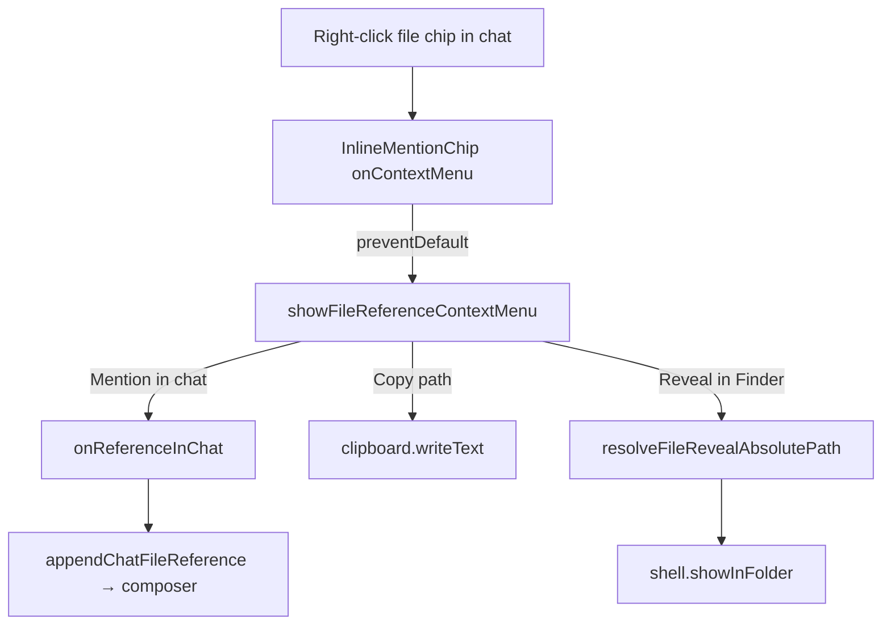
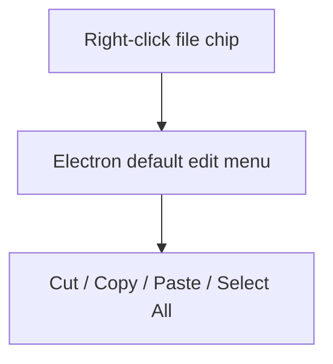

# Recap: Chat File Chip Context Menu

> Generated: 2026-08-03 | Scope: 9 files

---

## Summary

Right-clicking a file chip in the chat stream previously opened Electron's generic Cut / Copy / Paste menu. File chips now open the shared file-reference context menu with **Mention in chat**, **Copy path**, and **Reveal in Finder** (platform-aware). The same Reveal action is available from explorer rows, changed-file lists, and the file preview.

---

## Files Affected

| File                                                 | Status      | Role                                                                                      |
| ---------------------------------------------------- | ----------- | ----------------------------------------------------------------------------------------- |
| `apps/web/src/lib/fileReferenceContextMenu.ts`       | ✏️ Modified | Adds Reveal-in-folder, absolute-path resolution, and renames whole-file insert to Mention |
| `apps/web/src/lib/fileReferenceContextMenu.test.ts`  | ✅ Created  | Covers reveal path joining and platform labels                                            |
| `apps/web/src/lib/workspaceFileOpener.ts`            | ✏️ Modified | Extends opener context with `workspaceRoot` + `onReferenceInChat` for deep chat chips     |
| `apps/web/src/components/chat/inlineMentionChip.tsx` | ✏️ Modified | Wires right-click on path chips to the shared file menu                                   |
| `apps/web/src/components/chat/SingleChatSurface.tsx` | ✏️ Modified | Supplies workspace root and mention callback on dock/editor file openers                  |
| `apps/web/src/components/chat/workspaceExplorer.tsx` | ✏️ Modified | Passes workspace root into explorer/search context menus so Reveal resolves               |
| `apps/web/src/components/EditorWorkspaceView.tsx`    | ✏️ Modified | Passes workspace root into changed-file list context menus                                |
| `apps/web/src/components/WorkspaceFilePreview.tsx`   | ✏️ Modified | Passes workspace root into preview contents context menus                                 |
| `docs/RECAP-chat-file-chip-context-menu.md`          | ✅ Created  | Captures the implementation recap                                                         |

---

## Logic Explanation

### Problem

Markdown file links and path mention chips in the transcript only supported left-click open. A right-click fell through to the desktop shell's edit menu, so users could not copy the path, reveal the file in Finder, or re-mention it into the composer without leaving the stream.

### Approach

Reuse the existing desktop `showFileReferenceContextMenu` helper instead of inventing a second menu. Extend that helper with Reveal (via `shell.showInFolder`), thread the workspace root and mention callback through `WorkspaceFileOpenerContext`, and attach the menu to path-kind `InlineMentionChip` instances.

### Step-by-step

1. Right-click a path chip in chat → `InlineMentionChip` `preventDefault`s and calls `showFileReferenceContextMenu`.
2. Menu items: **Mention in chat** (when the surface provides `onReferenceInChat`), **Copy path**, and **Reveal in Finder** / **Show in Explorer** / **Show in Folder** when an absolute path can be resolved.
3. Mention appends `@path` into the hosting thread composer via `appendChatFileReference`.
4. Copy writes the position-stripped path to the clipboard.
5. Reveal joins a workspace-relative path with `workspaceRoot` (or uses an already-absolute path), then calls `api.shell.showInFolder`.
6. Explorer, changed-file rows, and file preview pass the same `workspaceRoot` so Reveal works outside the transcript too.

### Tradeoffs & Edge Cases

- Desktop-only: without `NativeApi.contextMenu`, the chip leaves the default browser/Electron edit menu alone.
- Reveal is omitted when the path is relative and no workspace root is available (or the relative path is unsafe).
- Plugin and thread mention chips stay out of the file menu; only `kind === "path"` chips open it.
- Whole-file insert label is now **Mention in chat**; ranged/selection inserts still say **Reference … in chat**.

---

## Flow Diagram

### Happy Path

### Before

---

## High School Explanation

Clicking a file name in chat used to open a boring text menu, like right-clicking random words. Now the file name knows it is a real file: you can drop it into the chat box as an `@mention`, copy its path, or ask Finder to light it up on disk — the same actions you already get from the file sidebar.

---

## Verification

- `bun run test src/lib/fileReferenceContextMenu.test.ts src/lib/workspaceFileOpener.test.ts` from `apps/web` — 22 passed.
- `bun run test src/components/EditorWorkspaceView.test.tsx src/lib/fileReferenceContextMenu.test.ts` from `apps/web` — 22 passed.
