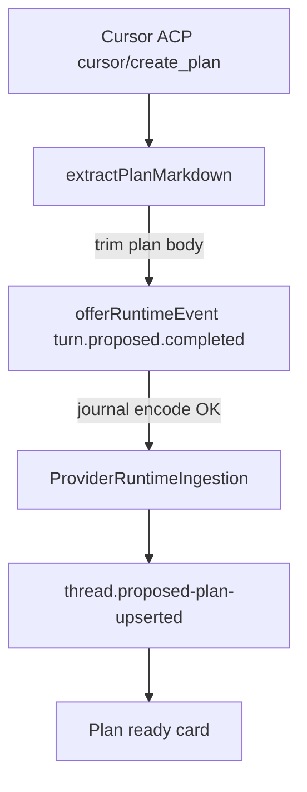
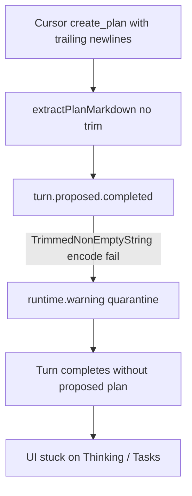

# Recap: Cursor Plan Markdown Trim

> Generated: 2026-08-03 | Scope: 2 files changed

---

## Summary

Cursor Plan mode could finish `create_plan` without ever showing the Plan card. Synara quarantined `turn.proposed.completed` when Cursor's plan body had leading or trailing whitespace, so the UI stayed on "Thinking" / Tasks until a later follow-up happened to succeed. `extractPlanMarkdown` now trims the plan body before journal encode.

---

## Files Affected

| File                                                      | Status   | Role                                                                                           |
| --------------------------------------------------------- | -------- | ---------------------------------------------------------------------------------------------- |
| `apps/server/src/provider/acp/CursorAcpExtension.ts`      | Modified | Trims Cursor `create_plan` markdown so it satisfies `TrimmedNonEmptyString` on journal encode. |
| `apps/server/src/provider/acp/CursorAcpExtension.test.ts` | Modified | Adds regression coverage for trailing/leading whitespace on plan bodies.                       |
| `docs/RECAP-cursor-plan-markdown-trim.md`                 | Created  | Captures the implementation recap.                                                             |

---

## Logic Explanation

### Problem

`turn.proposed.completed.payload.planMarkdown` is a `TrimmedNonEmptyString`. Cursor ACP often emits plan bodies that end with newlines. Durable journal encode rejected those payloads, `ProviderService` quarantined the event as a `runtime.warning`, and orchestration never upserted the proposed plan. From the UI: Create Plan / Tasks updated, turn completed, no "Plan ready" card.

Observed on thread `18b49fa1-8278-41fe-a0d2-d6083e43cc8e` (`Catalog quantity import script`): first `create_plan` quarantined at `16:41:08`; a later follow-up ("ti sei fermato?") produced a second plan that journaled cleanly.

### Approach

Normalize at the Cursor extension boundary — the same place Claude already trims exit-plan markdown — instead of loosening the contracts schema. Empty-after-trim still falls back to the existing placeholder plan text.

### Step-by-step

1. `extractPlanMarkdown` calls `params.plan.trim()`.
2. Non-empty trimmed text is returned as `planMarkdown`.
3. Empty trimmed text keeps `# Plan\n\n(Cursor did not supply plan text.)`.
4. `CursorAdapter` continues to emit `turn.proposed.completed` unchanged; journal encode now accepts the payload.

### Tradeoffs & Edge Cases

- Schema stays strict: accidental whitespace elsewhere still fails loudly.
- Only Cursor's create-plan extractor is hardened here; other providers that already trim keep their local behavior.
- Quarantine of a bad payload remains the correct backstop if a future path bypasses the extractor.

---

## Flow Diagram

### Happy Path

### Failure Before Fix

---

## High School Explanation

Cursor wrote a finished homework plan, but left a blank line at the end. Synara's filing cabinet only accepts papers with no blank edges, so it threw the plan in a quarantine bin and never put the "Plan ready" card on the desk. Now we trim those blank edges before filing, so the plan shows up as soon as Cursor finishes Create Plan.

---

## Verification

- `bun run test src/provider/acp/CursorAcpExtension.test.ts` from `apps/server` — 7 passed.
