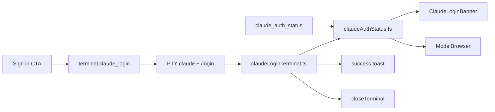

# 052 — Claude Code login UX

**Purpose:** Detect when the local Claude Code CLI is installed but **not signed in**, warn before the user wastes a chat turn, and guide them through `claude /login` in the integrated terminal — then confirm success and dismiss the login tab.

**Problem:** `claude_code_check` only probes `claude --version`. The CLI stderr `Not logged in · Please run /login` was shown raw in chat. New users had no in-app path to sign in.

**Related:** spawn/stream bridge in [014-claude-code-bridge.md](014-claude-code-bridge.md); OAuth usage panel in [023-session-usage-panel.md](023-session-usage-panel.md); Agent Mode terminal host in [084-agent-context-panels.md](084-agent-context-panels.md).

## Files

| Type | Path | Role |
|------|------|------|
| Rust | `src-tauri/src/claude_usage.rs` | `claude_auth_status` — read Keychain / `~/.claude/.credentials.json`, optional OAuth refresh |
| Register | `src-tauri/src/lib.rs` | `claude_auth_status` Tauri command |
| Probe | `src/claudeAuthStatus.ts` | `probeClaudeAuth`, 30s cache, pub/sub, `scheduleClaudeAuthRecheck` |
| Watch | `src/claudeLoginTerminal.ts` | PTY output watcher → toast + auto-close login tab |
| Banner | `src/components/ClaudeLoginBanner.tsx` | Composer warning + **Sign in** CTA |
| Host | `src/components/AIChatPanel.tsx` | 60s auth poll, banner gate, ModelBrowser props |
| Browser | `src/components/ModelBrowser.tsx` | CLI vs signed-in states + Sign in button |
| Provider | `src/providers/claudeCode.ts` | Rewrites auth stderr to actionable copy |
| Command | `src/actions.ts` | `terminal.claude_login` |
| CSS | `src/App.css` | `.ai-cc-login-banner*` (radius-lg, warn shimmer) |

## Data flow

## `claude_auth_status` (Rust)

| Field | Values |
|-------|--------|
| `status` | `signed_in` \| `signed_out` \| `needs_login` |
| `reason` | `no_credentials`, `no_oauth`, `api_key`, `no_access_token`, `refresh_failed` |
| `subscriptionType` | OAuth only, when signed in |

| Step | Behavior |
|------|----------|
| Load creds | macOS Keychain `Claude Code-credentials`, else `~/.claude/.credentials.json` |
| API key path | `anthropicApiKey` / `apiKey` / `api_key` non-empty → `signed_in` |
| OAuth valid | access token present and not expired → `signed_in` |
| OAuth expired | `refresh_oauth` (same as usage panel); success → `signed_in`, fail → `needs_login` |
| No network usage API | Does **not** call `claude_usage_limits` (avoids 429) |

## Frontend probe (`claudeAuthStatus.ts`)

| API | Role |
|-----|------|
| `probeClaudeAuth(force?)` | invoke + 30s TTL cache |
| `invalidateClaudeAuthCache()` | after login flow starts |
| `subscribeClaudeAuth(fn)` | banner refresh on recheck |
| `scheduleClaudeAuthRecheck()` | re-probe at 5s / 15s / 30s |

**Poll:** `AIChatPanel` when `selectedIsCC && claudeCodeAvailable` — immediate + every 60s.

## UI surfaces

| Surface | When | Action |
|---------|------|--------|
| `ClaudeLoginBanner` | CC model selected, CLI ok, `status !== signed_in` | **Sign in** → `terminal.claude_login` |
| `ModelBrowser` | CLI detected, not signed in | Subtitle + **Sign in**; empty state copy |
| Chat stderr | auth-like CLI line | Markdown hint → Sign in button above composer |
| Toast (start) | login terminal opens | Follow browser prompt in terminal |
| Toast (success) | PTY sees `Login successful` or `Logged in as` | Claude Code signed in — you're ready to chat |

## `terminal.claude_login`

| Step | Detail |
|------|--------|
| 1 | IDE only: `setBottomVisible(true)` + `setTermH(max(current, 440))` |
| 2 | `addTerminal(bottom, claude shell)` |
| 3 | Agent Mode: `setAgentContextPanel(wsId, term:id)` so the right-column Terminal tab hosts the interactive `/login` |
| 4 | `beginClaudeLoginWatch(wsId, termId)` |
| 5 | After 1200ms PTY write `/login\r` |
| 6 | `invalidateClaudeAuthCache` + `scheduleClaudeAuthRecheck` |

**Agent Mode:** bottom panel is unmounted — without step 3, Sign in would spawn a PTY the user cannot see. Same project terminal descriptors; see [084-agent-context-panels.md](084-agent-context-panels.md).

## Login terminal watcher (`claudeLoginTerminal.ts`)

| Match (PTY scrollback, ANSI stripped) | `/login successful\|logged in as/i` |
| On match | success toast → auth invalidate + recheck → `\r` to CLI → `closeTerminal` ~1.4s later |
| Timeout | 8 min watch, then unlisten |
| Dedup | one watch per `termId` |

## CSS (banner)

| Token / class | Notes |
|---------------|-------|
| `.ai-cc-login-banner` | `--radius-lg`, `--warn-bg`, `overflow: hidden` |
| `::after` | subtle warn shimmer (`cc-login-banner-shimmer`, 3.4s) |
| `.ai-cc-login-banner-btn` | `--primary-bg` / `--radius-pill` |

## Gotchas

| Topic | Note |
|-------|------|
| CLI ≠ login | Binary on PATH does not imply OAuth; banner closes false-positive gap |
| Not a Quack logout | `needs_login` usually means expired refresh or Keychain read failure — not app-initiated logout |
| Gotcha | Agent Mode | Sign in must call `setAgentContextPanel` — bottom panel is not mounted |
| macOS Keychain | Locked keychain can make probe and CLI disagree with iTerm until unlocked |
| Hook noise | `node: command not found` on `~/.quack/hooks/` is separate PATH issue — not auth |

## Out of scope (follow-ups)

- Block send until signed in
- Welcome modal Claude setup step
- In-app OAuth browser (no Anthropic API for this)
- PATH fix for user hooks when spawning `claude -p`
