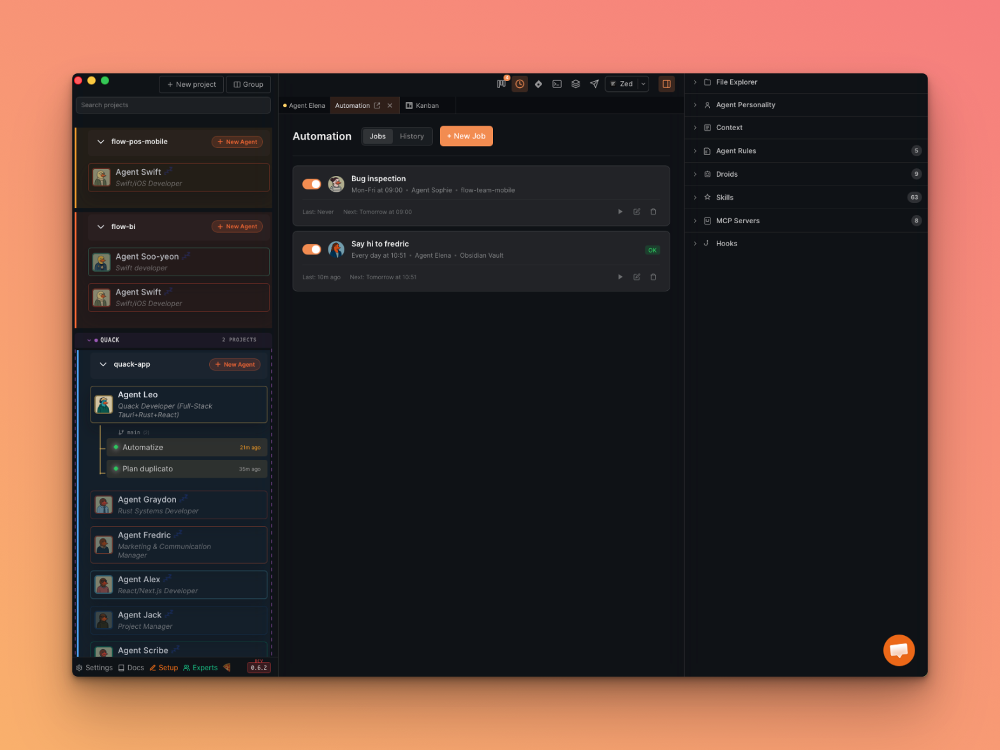
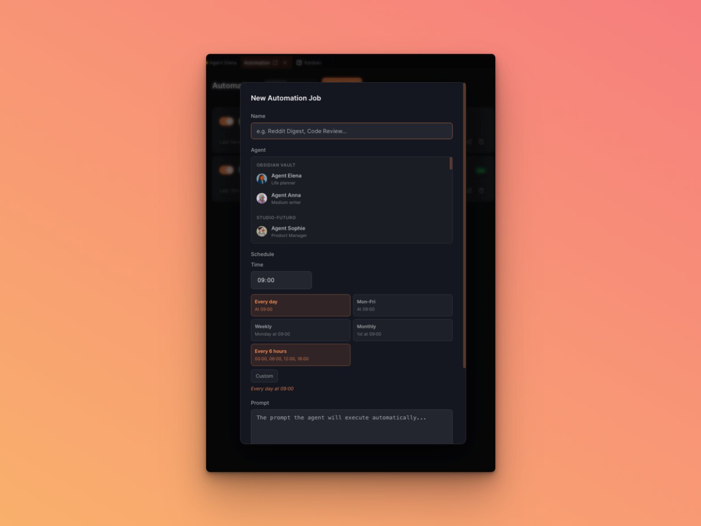
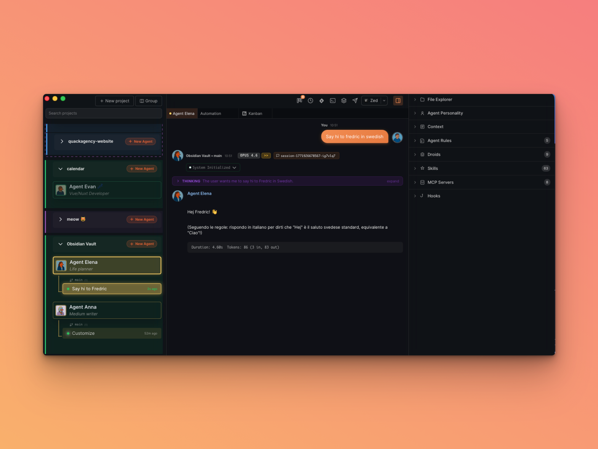

# Automations

Automations let you schedule recurring AI agent sessions. Define a job once — pick an agent, set a cron schedule, write a prompt — and Quack will automatically create a new session and execute the prompt at the scheduled time.

## Use Cases

- **Daily digest**: An agent reads your favorite subreddits every morning and suggests what to reply to
- **Scheduled code review**: Run a weekly code quality check on your project
- **Bug inspection**: A Mon-Fri agent scans open issues and triages them
- **Content planning**: An agent reviews your editorial calendar daily and drafts posts

## Opening the Automation Tab

- Click the **clock icon** in the action icons bar (top-right toolbar)
- Or press **Cmd+J** (macOS) / **Ctrl+J** (Windows)

The Automation tab opens alongside your other tabs (Chat, Kanban, etc.).

## Creating a Job

Click **+ New Job** to open the creation form.

### Fields

| Field | Description |
|-------|-------------|
| **Name** | A short label for the job (e.g. "Reddit Digest", "Code Review") |
| **Agent** | The AI agent that will execute the job. Agents are grouped by project — selecting an agent automatically sets the project. |
| **Schedule** | Choose a preset (Every day, Mon-Fri, Weekly, Monthly, Every 6 hours) or write a custom cron expression. A preview shows when the next run will fire. |
| **Prompt** | The prompt the agent will execute automatically when the job fires. |

### Cron Presets

| Preset | Cron Expression | Description |
|--------|----------------|-------------|
| Every day | `0 9 * * *` | At 09:00 every day |
| Mon-Fri | `0 9 * * 1-5` | At 09:00, Monday through Friday |
| Weekly | `0 9 * * 1` | Monday at 09:00 |
| Monthly | `0 9 1 * *` | 1st of the month at 09:00 |
| Every 6 hours | `0 */6 * * *` | 00:00, 06:00, 12:00, 18:00 |
| Custom | Any valid cron | Write your own 5-field expression |

All times use your **local Mac/PC timezone**.

## How Jobs Execute

When a scheduled job fires:

1. Quack creates a new **Agent Session** under the target agent, titled `[Auto] Job Name`
2. The session appears in the sidebar under the agent, just like a manually created session
3. The prompt is sent automatically — the agent processes it and responds

You can click on the session to read the response, continue the conversation, or mark it as done.

## Managing Jobs

Each job card shows:

- **Toggle switch** — enable/disable the job without deleting it
- **Status badge** — Running, OK (last run succeeded), or Failed
- **Last run / Next run** — timestamps in your local timezone
- **Action buttons** — Play (fire now), Edit, Delete

### Fire Now

Click the **play button** on any job card to fire it immediately, regardless of schedule. This creates a session right away.

### History Tab

Switch to the **History** tab to see a log of all past runs with status, duration, and a link to open the resulting session.

## Architecture (For Developers)

The automation system has two layers:

- **Rust scheduler** (`src-tauri/src/automation.rs`): A tokio interval loop that emits tick events every 30 seconds
- **React frontend** (`src/components/automation/AutomationView.tsx`): Listens for ticks, checks `nextRunAt` for all enabled jobs, and fires jobs when due

Jobs are persisted in a Tauri Store file (`quack-automations.json`). The Zustand store (`automationStore.ts`) manages runtime state.

See `documentation/patterns/pattern-automation-layer.md` for the full technical architecture.
