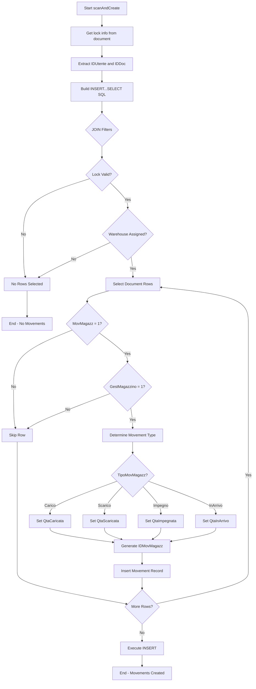
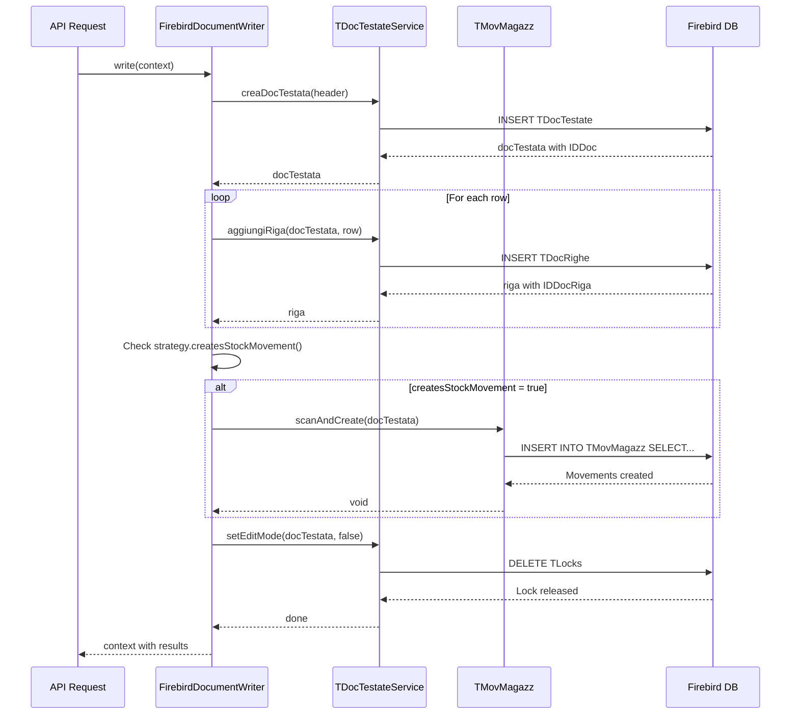
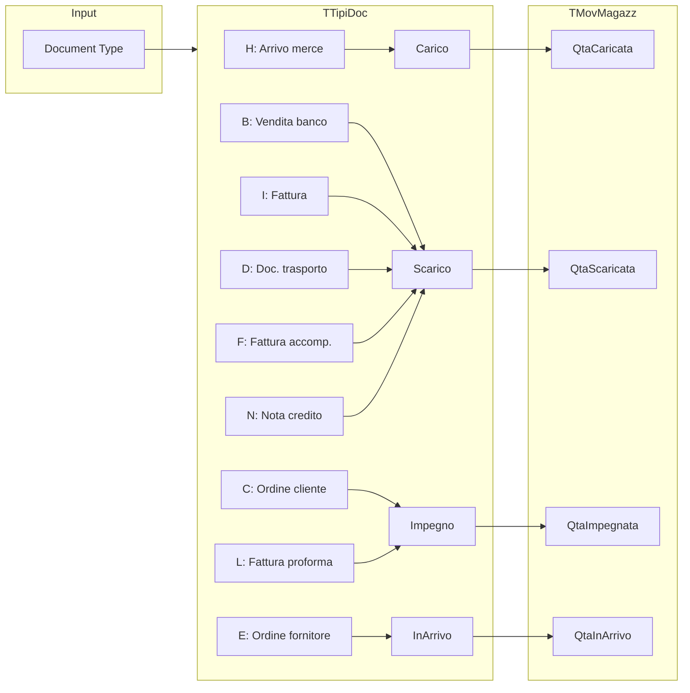

# scanAndCreate Algorithm - Warehouse Movement Generation

## Overview

The `scanAndCreate` algorithm is a bulk warehouse movement generation mechanism that atomically creates stock movement records for all qualifying rows of a document in a single SQL operation. It is nicknamed "Silvano's Magic" within the codebase due to its elegant single-query approach.

**Location**: `App\Services\Danea\TMagazz\TMovMagazzSilvanoMagicsTrait::scanAndCreate()`

**File**: `app/Services/Danea/TMagazz/TMovMagazzSilvanoMagicsTrait.php:10-43`

## Input/Output

### Input
| Parameter | Type | Description |
|-----------|------|-------------|
| `$docTestata` | `TDocTestate` | The document header for which to create movements |

### Output
| Return | Type | Description |
|--------|------|-------------|
| - | `void` | No return value; movements created directly in database |

### Side Effects
- Creates 0 to N records in `TMovMagazz` table
- Each qualifying document row produces one movement record

## Step-by-Step Explanation

### 1. Extract Lock Information

```php
$idUtente = $docTestata->lock()->IDUtente;
$idDoc = $docTestata->IDDoc;
```

- **Purpose**: Retrieve the user ID holding the document lock and the document ID
- **Security**: Ensures only the lock owner can create movements
- **Reference**: `TMovMagazzSilvanoMagicsTrait.php:12-13`

### 2. Build Dynamic SQL Query

The method constructs a single `INSERT INTO ... SELECT` statement that:

#### 2.1 Generate Unique Movement ID
```sql
(SELECT GEN_ID("TMovMagazz__IDMovMagazz", 1) FROM RDB$DATABASE) AS "IDMovMagazz"
```
- Uses Firebird's generator to create sequential, unique IDs
- Each selected row gets its own unique ID

#### 2.2 Extract Product and Warehouse Data
```sql
"TDocRighe"."IDArticoloScaricato" AS "IDArticolo",
"TDocTestate"."Magazz" AS "Magazz",
"TDocRighe"."Lotto" AS "Lotto",
"TDocRighe"."DataScadenza" AS "DataScadenza"
```
- Maps product ID from the "unloaded product" field
- Takes warehouse from document header
- Preserves lot traceability information

#### 2.3 Route Quantity to Correct Column
```sql
IIF("TTipiDoc"."TipoMovMagazz" = 'Carico', "TDocRighe"."Qta", NULL) AS "QtaCaricata",
IIF("TTipiDoc"."TipoMovMagazz" = 'Scarico', "TDocRighe"."Qta", NULL) AS "QtaScaricata",
IIF("TTipiDoc"."TipoMovMagazz" = 'Impegno', "TDocRighe"."Qta", NULL) AS "QtaImpegnata",
IIF("TTipiDoc"."TipoMovMagazz" = 'InArrivo', "TDocRighe"."Qta", NULL) AS "QtaInArrivo"
```
- Uses Firebird's `IIF()` conditional function
- Only one quantity column receives the value based on document type
- Other columns remain NULL

### 3. Apply JOIN Filters

```sql
FROM "TLocks"
JOIN "TDocTestate" ON LEFT("TLocks"."NomeLock",12) = 'TDocTestate.'
    AND "TDocTestate"."IDDoc" = $idDoc
    AND "TDocTestate"."Magazz" IS NOT NULL
    AND "TLocks"."IDUtente" = $idUtente
JOIN "TDocRighe" ON "TDocTestate"."IDDoc" = "TDocRighe"."IDDoc"
    AND "TDocRighe"."MovMagazz" = 1
JOIN "TArticoli" ON "TDocRighe"."IDArticoloScaricato" = "TArticoli"."IDArticolo"
    AND "TArticoli"."GestMagazzino" = 1
JOIN "TTipiDoc" ON "TDocTestate"."TipoDoc" = "TTipiDoc"."TipoDoc"
```

**Filter Conditions**:
| Condition | Purpose |
|-----------|---------|
| `TLocks.IDUtente = $idUtente` | Security: only lock owner proceeds |
| `TDocTestate.Magazz IS NOT NULL` | Requires warehouse assignment |
| `TDocRighe.MovMagazz = 1` | Row must have stock movement enabled |
| `TArticoli.GestMagazzino = 1` | Product must have inventory management enabled |

### 4. Execute Query

```php
DB::connection('firebird')->unprepared($sql);
```
- Uses Laravel's `unprepared()` for raw SQL execution
- Executes on the Firebird connection
- Atomic: all movements created in single transaction

## Algorithm Flowchart



## Integration Sequence Diagram



## Movement Type Routing



## Complexity Analysis

### Time Complexity
- **O(N)** where N = number of qualifying document rows
- Single SQL execution regardless of row count
- No application-level iteration for insert operations

### Space Complexity
- **O(1)** in application memory
- Database handles result set internally
- No intermediate collections built in PHP

### Performance Characteristics
| Metric | Value |
|--------|-------|
| SQL Queries | 1 (single INSERT...SELECT) |
| Network Roundtrips | 1 |
| Lock Verification | Built into query (no separate check) |
| ID Generation | Per-row via Firebird generator |

## Edge Cases

### No Warehouse Assigned
- **Condition**: `TDocTestate.Magazz IS NULL`
- **Behavior**: JOIN fails, no movements created
- **Note**: Strategy should validate `requiresWarehouse()` before calling

### No Inventory Products
- **Condition**: All products have `GestMagazzino = 0`
- **Behavior**: No rows match, zero movements created
- **Use Case**: Services-only documents

### Stock Movement Disabled on All Rows
- **Condition**: All rows have `MovMagazz = 0`
- **Behavior**: No rows match, zero movements created
- **Use Case**: Discount-only or note-only documents

### Lock Not Held by User
- **Condition**: `TLocks.IDUtente != $idUtente`
- **Behavior**: JOIN fails, no movements created
- **Security**: Prevents unauthorized modifications

### Empty Document
- **Condition**: Document has zero rows in `TDocRighe`
- **Behavior**: SELECT returns empty set, zero movements created
- **Note**: Valid scenario for placeholder documents

## Related Components

| Component | File | Relationship |
|-----------|------|--------------|
| TMovMagazz Model | `app/Services/Danea/TMagazz/TMovMagazz.php` | Uses this trait |
| TMagazz Model | `app/Services/Danea/TMagazz/TMagazz.php` | Warehouse master data |
| TArticoliMagazz | `app/Services/Danea/TArticoli/TArticoliMagazz.php` | Aggregate stock levels |
| FirebirdDocumentWriter | `app/Modules/Documents/Writers/FirebirdDocumentWriter.php` | Calls scanAndCreate |
| TTipiDoc | `app/Services/Danea/TTipiDoc/TTipiDoc.php` | Defines movement types |

## See Also

- [Warehouse Movements System](../danea/warehouse-movements.md)
- [Warehouse Movement Use Cases](../danea/warehouse-movements-use-cases.md)
- [Warehouse Movement Service Architecture](../architecture/services/warehouse-movement-service.md)
- [Document Writers](../architecture/services/document-writers.md)
