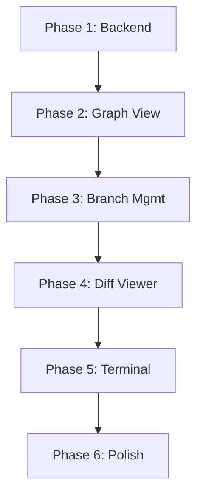

# Git Integration Improvement - Specification Mode Plan

**Project**: TerminalFlow (quack-app)
**Duration**: 6-8 days (4-6 phases)
**Lead**: Mike (Project Manager) → Julie (UI/UX) + John (Backend)
**Priority**: High - Core feature enhancement

## 🎯 Executive Summary

Transform the existing basic Git panel into a comprehensive, visual Git management system that integrates seamlessly with TerminalFlow's liquid design language. The system will provide advanced Git visualization, quick actions, and smooth terminal integration while maintaining the app's signature glass-morphism aesthetic.

## 📊 Current State Analysis

### Existing Components
- ✅ **GitPanel.tsx**: Basic Git status display with staging/commit functionality
- ✅ **git.rs**: Rust backend with core Git operations (status, diff, stage, commit)
- ✅ **Git Commands**: Working commands for status, diff, stage, unstage, commit, history
- ✅ **Timeline View**: Basic commit history with timeline visualization
- ✅ **Diff Viewer**: Inline diff display with syntax highlighting

### Current Limitations
- ❌ No branch visualization (tree/graph view)
- ❌ No branch management (create, switch, merge, delete)
- ❌ No push/pull/fetch operations
- ❌ No stash management
- ❌ No conflict resolution UI
- ❌ No file history tracking
- ❌ Limited visual feedback for Git operations
- ❌ No integration with terminal for Git commands

## 🏗️ Architecture Integration Points

### Frontend Integration
```typescript
// Main App.tsx hooks into:
- GitPanel component (existing)
- New GitGraphView component
- New GitBranchManager component
- Enhanced GitDiffViewer with side-by-side view
- GitQuickActions toolbar
```

### Backend Integration
```rust
// Enhanced git.rs module:
- Branch operations (list, create, switch, merge, delete)
- Remote operations (fetch, pull, push)
- Stash operations (save, list, apply, pop)
- Graph data generation for visualization
- Conflict detection and resolution helpers
```

### Design System Alignment
- **Glass-morphism**: Maintain existing `backdrop-filter: blur(12px)`
- **Liquid animations**: GSAP-powered transitions for Git operations
- **Color palette**: Use existing accent colors (#f28c52, #4dd4b3, #8fa6ff)
- **Typography**: IBM Plex Mono for code, Inter for UI text

---

## 📋 PHASE 1: Enhanced Git Backend & Data Layer
**Duration**: 1-2 days
**Owner**: John (Backend)
**Dependencies**: None

### Objectives
- [ ] Extend Rust Git module with branch operations
- [ ] Implement remote operations (fetch, pull, push)
- [ ] Add stash management commands
- [ ] Create graph data structure for branch visualization
- [ ] Implement file history tracking

### Technical Requirements
```rust
// New commands in git.rs
- git_list_branches(local: bool, remote: bool)
- git_create_branch(name: String, from: Option<String>)
- git_switch_branch(name: String)
- git_merge_branch(branch: String, options: MergeOptions)
- git_delete_branch(name: String, force: bool)
- git_fetch(remote: Option<String>)
- git_pull(remote: Option<String>, branch: Option<String>)
- git_push(remote: Option<String>, branch: Option<String>)
- git_stash_save(message: Option<String>)
- git_stash_list()
- git_stash_apply(index: Option<usize>)
- git_graph_data(limit: usize) -> GitGraph
- git_file_history(path: String, limit: usize)
```

### Testing Points
- [ ] Test branch operations with multiple branches
- [ ] Verify remote operations with test repository
- [ ] Test stash operations with modified files
- [ ] Validate graph data structure generation
- [ ] Test file history with renamed/moved files

### Risks & Mitigation
- **Risk**: Git command failures on different platforms
  - **Mitigation**: Comprehensive error handling, fallback to simpler commands
- **Risk**: Performance with large repositories
  - **Mitigation**: Implement pagination, lazy loading for history

### Rollback Plan
- Keep existing git.rs functions unchanged
- New functions in separate module that can be disabled
- Feature flag for new Git operations

---

## 📋 PHASE 2: Branch Visualization & Graph View
**Duration**: 1.5-2 days
**Owner**: Julie (UI/UX Designer)
**Dependencies**: Phase 1 completion

### Objectives
- [ ] Design and implement GitGraphView component
- [ ] Create interactive branch tree visualization
- [ ] Implement commit node interactions
- [ ] Add branch line drawing with proper merging visuals
- [ ] Integrate with existing timeline view

### Technical Requirements
```typescript
// New component: GitGraphView.tsx
interface GitGraphViewProps {
  graph: GitGraph;
  onCommitSelect: (hash: string) => void;
  onBranchSelect: (name: string) => void;
  selectedCommit?: string;
  selectedBranch?: string;
}

// Features:
- SVG-based graph rendering
- Animated transitions on branch switches
- Hover tooltips with commit details
- Click to view diff
- Right-click context menu for operations
```

### UI/UX Design Specs
```css
/* Glass-morphism graph container */
.git-graph-container {
  background: rgba(15, 17, 26, 0.85);
  backdrop-filter: blur(12px);
  border: 1px solid rgba(255, 255, 255, 0.08);
  border-radius: 12px;
}

/* Branch lines with gradients */
.branch-line {
  stroke: url(#branch-gradient);
  stroke-width: 2px;
  filter: drop-shadow(0 2px 4px rgba(0,0,0,0.3));
}

/* Commit nodes with pulse animation */
@keyframes commit-pulse {
  0%, 100% { transform: scale(1); opacity: 1; }
  50% { transform: scale(1.1); opacity: 0.9; }
}
```

### Testing Points
- [ ] Test graph rendering with complex branch structures
- [ ] Verify animations work smoothly with GSAP
- [ ] Test interactions (click, hover, right-click)
- [ ] Validate responsive design at different sizes
- [ ] Test with light/dark theme variants

### Risks & Mitigation
- **Risk**: Performance issues with large graphs
  - **Mitigation**: Virtual scrolling, render only visible nodes
- **Risk**: Complex merge visualizations
  - **Mitigation**: Simplified view option, collapsible sections

### Rollback Plan
- Component can be hidden via feature flag
- Fallback to existing timeline view
- Progressive enhancement approach

---

## 📋 PHASE 3: Branch Management & Quick Actions
**Duration**: 1-1.5 days
**Owner**: Julie (UI/UX) + John (Backend integration)
**Dependencies**: Phase 2 completion

### Objectives
- [ ] Create GitBranchManager component
- [ ] Implement branch switcher dropdown
- [ ] Add quick action toolbar
- [ ] Create branch creation/deletion modals
- [ ] Implement merge UI with conflict preview

### Technical Requirements
```typescript
// New component: GitBranchManager.tsx
interface GitBranchManagerProps {
  currentBranch: string;
  branches: GitBranch[];
  onSwitch: (branch: string) => void;
  onCreate: (name: string, from?: string) => void;
  onDelete: (branch: string) => void;
  onMerge: (from: string, to: string) => void;
}

// GitQuickActions.tsx
interface QuickAction {
  icon: string;
  label: string;
  action: () => void;
  shortcut?: string;
  enabled: boolean;
}
```

### UI Components
```
┌─────────────────────────────────────┐
│ 🎯 Quick Actions Bar                │
├─────────────────────────────────────┤
│ [Pull] [Push] [Fetch] [Stash]      │
│ [New Branch] [Merge] [Tag]         │
└─────────────────────────────────────┘

┌─────────────────────────────────────┐
│ 📍 Branch Switcher                  │
├─────────────────────────────────────┤
│ ▼ main                              │
│   ├─ feature/new-ui                │
│   ├─ fix/bug-123                   │
│   └─ develop                       │
└─────────────────────────────────────┘
```

### Testing Points
- [ ] Test branch switching with uncommitted changes
- [ ] Verify merge conflict detection
- [ ] Test quick actions enable/disable logic
- [ ] Validate modal interactions
- [ ] Test keyboard shortcuts

### Risks & Mitigation
- **Risk**: Destructive operations (force push, branch delete)
  - **Mitigation**: Confirmation dialogs, undo capability
- **Risk**: Merge conflicts
  - **Mitigation**: Preview before merge, clear conflict UI

### Rollback Plan
- Quick actions can be disabled individually
- Branch manager falls back to terminal commands
- Existing Git panel remains functional

---

## 📋 PHASE 4: Advanced Diff Viewer & File History
**Duration**: 1.5 days
**Owner**: Julie (UI/UX)
**Dependencies**: Phase 3 completion

### Objectives
- [ ] Implement side-by-side diff viewer
- [ ] Add file history browser
- [ ] Create blame view integration
- [ ] Add diff navigation controls
- [ ] Implement syntax highlighting for diffs

### Technical Requirements
```typescript
// Enhanced DiffViewer.tsx
interface DiffViewerProps {
  diff: string;
  viewMode: 'inline' | 'split' | 'unified';
  syntax?: string; // for highlighting
  onNavigate: (line: number) => void;
  showLineNumbers: boolean;
  showFileTree: boolean;
}

// FileHistory.tsx
interface FileHistoryProps {
  path: string;
  commits: GitCommit[];
  onCommitSelect: (hash: string) => void;
  onDiffView: (from: string, to: string) => void;
}
```

### UI Layout
```
┌──────────────┬──────────────┐
│   Original   │   Modified   │
├──────────────┼──────────────┤
│ - old line   │ + new line   │
│   unchanged  │   unchanged  │
│ - removed    │              │
│              │ + added      │
└──────────────┴──────────────┘
```

### Testing Points
- [ ] Test with large diffs (performance)
- [ ] Verify syntax highlighting accuracy
- [ ] Test navigation between diff chunks
- [ ] Validate file history with renames
- [ ] Test blame view integration

### Risks & Mitigation
- **Risk**: Large diff performance
  - **Mitigation**: Virtual scrolling, progressive loading
- **Risk**: Complex merge diffs
  - **Mitigation**: Simplified view option

### Rollback Plan
- Keep existing inline diff viewer
- New features behind feature flags
- Progressive enhancement

---

## 📋 PHASE 5: Terminal Integration & Smart Commands
**Duration**: 1 day
**Owner**: John (Backend) + Julie (Frontend)
**Dependencies**: Phase 4 completion

### Objectives
- [ ] Create Git command palette
- [ ] Implement terminal Git command detection
- [ ] Add command suggestions based on context
- [ ] Create Git command history
- [ ] Implement visual feedback for terminal Git commands

### Technical Requirements
```typescript
// GitCommandPalette.tsx
interface GitCommand {
  command: string;
  description: string;
  category: 'basic' | 'branch' | 'remote' | 'advanced';
  requiresInput?: string[];
  dangerous?: boolean;
}

// Terminal integration
- Detect git commands in terminal input
- Show visual feedback in Git panel
- Sync panel state with terminal operations
- Provide command completions
```

### Testing Points
- [ ] Test command detection accuracy
- [ ] Verify sync between terminal and UI
- [ ] Test command suggestions relevance
- [ ] Validate dangerous command warnings
- [ ] Test command history persistence

### Risks & Mitigation
- **Risk**: Command detection false positives
  - **Mitigation**: Whitelist approach, user confirmation
- **Risk**: Sync delays
  - **Mitigation**: Debouncing, optimistic updates

### Rollback Plan
- Disable terminal integration via settings
- Keep manual refresh option
- Independent operation modes

---

## 📋 PHASE 6: Polish, Animation & Performance
**Duration**: 1 day
**Owner**: Julie (UI/UX)
**Dependencies**: Phase 5 completion

### Objectives
- [ ] Implement GSAP animations for all transitions
- [ ] Add loading states and skeletons
- [ ] Optimize performance for large repos
- [ ] Add keyboard shortcuts
- [ ] Implement user preferences

### Animation Specifications
```javascript
// GSAP animations
const branchSwitchAnimation = {
  duration: 0.4,
  ease: "power2.inOut",
  scale: [1, 0.95, 1],
  opacity: [1, 0.8, 1],
  filter: ["blur(0px)", "blur(4px)", "blur(0px)"]
};

const commitNodeAnimation = {
  duration: 0.3,
  ease: "elastic.out(1, 0.3)",
  scale: [0, 1],
  stagger: 0.02
};
```

### Performance Optimizations
- Virtual scrolling for large lists
- Memoization of expensive computations
- Lazy loading of diff content
- Web Workers for graph calculations
- Debounced refresh operations

### Testing Points
- [ ] Test with repos > 10,000 commits
- [ ] Verify smooth animations at 60fps
- [ ] Test memory usage over time
- [ ] Validate keyboard navigation
- [ ] Test preference persistence

### Risks & Mitigation
- **Risk**: Animation jank
  - **Mitigation**: GPU acceleration, reduced motion option
- **Risk**: Memory leaks
  - **Mitigation**: Proper cleanup, component unmounting

### Rollback Plan
- Animations can be disabled
- Performance optimizations optional
- Fallback to simpler visualizations

---

## 🔄 Dependencies & Integration

### Internal Dependencies


### External Dependencies
- Git executable (system requirement)
- GSAP library for animations
- D3.js or custom SVG for graph rendering
- Prism.js for syntax highlighting

---

## ⚠️ Risk Assessment

### High Risk Items
1. **Large Repository Performance**
   - Impact: High
   - Probability: Medium
   - Mitigation: Pagination, lazy loading, virtual scrolling

2. **Git Operation Failures**
   - Impact: High
   - Probability: Low
   - Mitigation: Comprehensive error handling, rollback capabilities

### Medium Risk Items
1. **Complex Merge Visualizations**
   - Impact: Medium
   - Probability: Medium
   - Mitigation: Simplified view options, progressive disclosure

2. **Cross-platform Git Differences**
   - Impact: Medium
   - Probability: Medium
   - Mitigation: Abstract Git operations, platform-specific handlers

### Low Risk Items
1. **Animation Performance**
   - Impact: Low
   - Probability: Low
   - Mitigation: GPU acceleration, reduced motion settings

---

## ✅ Success Criteria

### Functional Requirements
- [ ] All Git operations work reliably across platforms
- [ ] Branch visualization renders correctly for complex graphs
- [ ] Diff viewer handles files > 10,000 lines
- [ ] Terminal integration detects 95%+ of Git commands
- [ ] Performance remains smooth with large repositories

### Non-Functional Requirements
- [ ] Page load time < 500ms
- [ ] Operation feedback < 100ms
- [ ] Animations at 60fps
- [ ] Memory usage < 200MB for typical usage
- [ ] Accessibility: Full keyboard navigation

### User Experience Goals
- [ ] 80% of Git operations achievable via UI
- [ ] Learning curve < 10 minutes for basic operations
- [ ] Visual consistency with TerminalFlow design
- [ ] Intuitive navigation between views
- [ ] Clear error messages and recovery paths

---

## 📅 Timeline & Milestones

```
Week 1:
├─ Day 1-2: Phase 1 (Backend)
├─ Day 3-4: Phase 2 (Graph View)
└─ Day 5: Phase 3 (Branch Management)

Week 2:
├─ Day 6-7: Phase 4 (Diff Viewer)
├─ Day 7: Phase 5 (Terminal Integration)
└─ Day 8: Phase 6 (Polish & Performance)
```

### Key Milestones
- **Milestone 1** (Day 2): Backend API complete
- **Milestone 2** (Day 4): Visual graph rendering
- **Milestone 3** (Day 5): Branch operations working
- **Milestone 4** (Day 7): Advanced diff viewer live
- **Milestone 5** (Day 8): Feature complete & polished

---

## 🚀 Rollback Strategy

Each phase includes independent rollback capabilities:

1. **Backend Rollback**: Keep original git.rs, new features in git_advanced.rs
2. **UI Rollback**: Feature flags for each new component
3. **Data Rollback**: No database changes, only memory state
4. **Integration Rollback**: Terminal integration can be disabled
5. **Performance Rollback**: Optimizations can be toggled off

Emergency rollback procedure:
```bash
# Disable new Git features
export FEATURE_GIT_ADVANCED=false
# Restart application
npm run tauri:dev
```

---

## 📝 Final Notes

This plan provides a comprehensive, phased approach to enhancing Git integration in TerminalFlow. Each phase builds upon the previous one while maintaining independent rollback capabilities. The focus on visual consistency with the existing liquid/glass-morphism design ensures a seamless user experience.

Key success factors:
- Strong backend foundation (Phase 1)
- Visual excellence (Phase 2-4)
- Seamless integration (Phase 5)
- Performance and polish (Phase 6)

The modular approach allows for adjustments based on user feedback and technical constraints while maintaining forward progress toward a best-in-class Git integration.