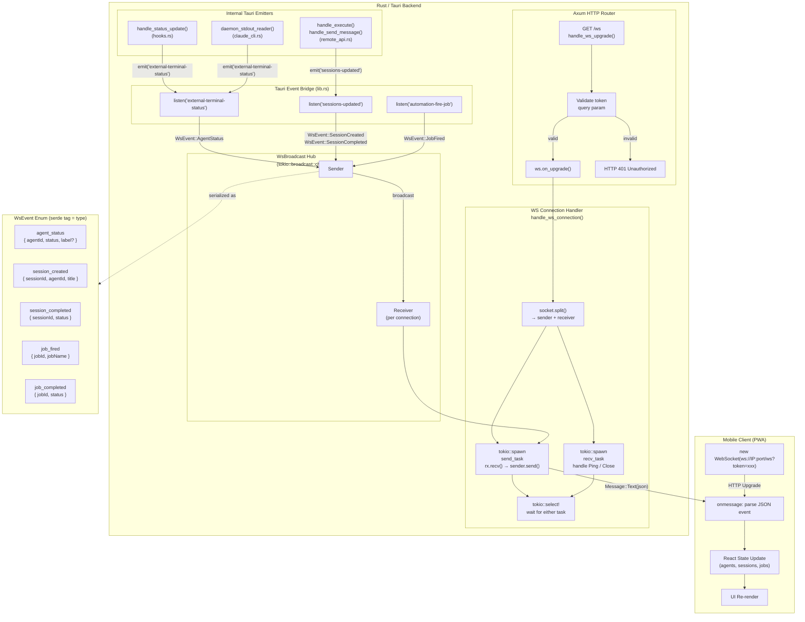

# WebSocket Data Flow — Remote Module

Diagramma del flusso dati: WebSocket client mobile → Rust handler → React state.

## Note architetturali

- `WsBroadcast` wrappa un `tokio::broadcast::Sender<WsEvent>` — ogni chiamata `.subscribe()` crea un nuovo `Receiver` indipendente. N client possono connettersi senza lock.
- Il bridge in `lib.rs` usa `app.listen()` (Tauri) per trasformare eventi interni in messaggi WebSocket. Questo disaccoppia completamente la logica business dal layer di trasporto.
- L'autenticazione avviene prima dell'upgrade HTTP, tramite query param `?token=`. Dopo l'upgrade non c'è modo di rifiutare la connessione senza chiuderla.
- I task `send_task` e `recv_task` girano in parallelo; `tokio::select!` garantisce cleanup immediato su disconnect.
- Gli eventi sono serializzati con `serde_json` usando `#[serde(tag = "type", rename_all = "snake_case")]` — il campo `type` discrimina il tipo di evento sul client.
